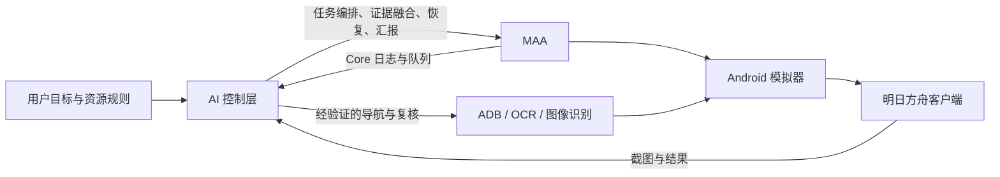

# AI 自动化｜MAA 明日方舟 AI 控制 Skill

让 AI 在 Windows 上编排、监管和验证 MAA（MaaAssistantArknights）流程，补足单次任务链之外的目标管理、页面导航、图像复核、作业切换、异常恢复和真实结果汇报。

> 本项目不是 MAA 官方项目，不修改也不分发 MAA 本体。使用者需要自行安装 MAA、模拟器和《明日方舟》客户端，并自行承担真实账号自动化操作的风险。

## 相比单纯 MAA 脚本的两项核心进步

### 1. 自动寻找并推进未通关主线

AI 不只执行预先写死的单个关卡任务，而是从当前游戏界面读取章节、地图和节点状态，寻找下一个未完成目标，并在剧情关、普通战斗、H 关和特殊节点之间切换合适的处理方式。战斗节点交给 MAA 作业执行，剧情节点由受控导航处理；每一步都要用地图标记、结算画面或 Core 日志复核，再继续推进后面的未通关节点。

**教学关卡仍保留人工接管边界。** 自动化识别到教学流程时应暂停并说明原因，不盲点、不把教学关伪装成普通作业，也不擅自跳过用户尚未授权的内容。

### 2. 肉鸽结算后自动加点、领奖并续跑

AI 会在真实探索结算后进入当前主题的等级奖励和常驻成长页面，领取可领报酬、分配可用成长点，核对领取标记或点数变化，然后返回同一主题继续原有探索队列。奖励维护不是另一条会打断战斗的固定宏，而是只在安全结算边界触发的受控服务流程。

这两项能力依赖项目中的实际控制适配器、页面识别规则和验证过的组件。公开 Skill 提供控制模型、工作流、门禁和迁移引导，**不包含作者私有生产环境的完整执行器、账号配置或运行证据**。

## 它解决什么问题

MAA 很擅长执行具体任务，但跨天、跨模式、跨页面的长期自动化仍需要一个上层控制者。本 Skill 把 AI 放在 MAA 之上，负责：

- 把用户目标编译成带优先级、成功证据、失败转移和停止条件的执行契约；
- 融合游戏截图/OCR、MAA Core 日志、GUI 队列和持久化检查点判断真实进度；
- 区分战斗失败、作业不适配、界面中断和技术故障，避免把不同问题混成“重试失败”；
- 在不抢占活跃 MAA 操作流的前提下，用 ADB 和图像识别补足导航、剧情、教程、公告与结算复核；
- 在结束时输出一次可信报告，并按契约清理游戏、MAA、模拟器和日志窗口。

## 已覆盖的自动化能力

### 每日与每周任务

- 自动启动、基建、招募、信用商店、任务奖励等日常链；
- 周一优先检查并完成每周剿灭委托，以合成玉周上限作为完成证据；
- 按明确用途消耗理智，记录具体关卡、次数、结果和剩余理智；
- 理智耗尽后再次执行最终日常、基建与奖励领取；
- 全流程结束后只弹一次真实汇报，再关闭所拥有的相关进程。
- 当前活动优先于主线；仅在当前无更高优先任务且适用主线/隐藏层均已核验完成时，才进入契约指定的兜底刷取；
- 根据本轮新鲜仓库状态选择项目方批准的基建生产方案，库存读取失败时保持现状；
- 核验保全派驻当前周期与奖励上限：已封顶允许无动作收口，未封顶则要求独立验收过的执行器；

### 主线推进

- 从当前地图自动寻找下一个未通关节点并连续推进，而不是只能重复预设关卡；
- 识别章节、关卡地图与目标节点，验证待办是否已经完成；
- 结合节点图形、结算画面和 MAA 日志判断是否完美通关；
- 区分剧情关、教学关、普通关、H 关及特殊模式；
- 剧情关受控推进，战斗关调用对应 MAA 作业，教学关暂停并交给人工；
- 搜索并切换不同 MAA 作业，避免把同一份作业反复重试伪装成多次方案；
- 对缺少干员、助战要求、作业无效和真实战斗失败分别处理。

### 限时活动

- 从终端活动卡识别活动状态与剩余时间；
- 区分新活动、复刻活动、普通关、突袭/EX 与后续开放内容；
- 在作业可用时自动过关、复核奖励，并按用户指定关卡消耗剩余理智；
- 对教学、小游戏或尚无可靠作业的入口保留人工接管边界。

### 肉鸽（集成战略）

- 按主题、阶段与难度持续爬塔或刷经验；
- 监管 MAA 队列，区分普通探索失败与技术故障；
- 在结算边界自动领取等级奖励、分配常驻成长点，并回到同一主题继续；
- 用奖励标记清除、成长货币减少或节点完成状态证明加点和领奖确实发生；
- 支持月度小队、深入调查和经验长跑的目标隔离，防止奖励任务互相插入；
- 记录高失败率关卡、部署和最终崩盘证据，供后续策略迭代；
- 支持硬截止、三次快速恢复和冷却后再试，避免影响下一轮每日自动化。

### 生息演算

- 监管 MAA 的循环代理，用于繁荣度、经验或材料目标；
- 根据奖励目标和检查点决定继续或停止；
- 通过 MAA 正常停止入口退出循环，避免强杀造成状态损坏；
- 将整点刷新、意外退出和模拟器异常作为可恢复状态处理。

### 稳定性与可审计性

- MAA 更新、首次引导、公告、登录提示、剧情和教程中断恢复；
- 单控制器/单队列约束，防止双窗口、双脚本和前台鼠标争用；
- 以 ADB 截图和 Android 输入为主，Windows UI Automation 只用于 MAA 控件；
- 技术故障最多三次快速恢复，连续失败后完整清理并冷却；
- 事实、推断和未验证假设分开记录，不用进程存在冒充任务完成。
- 页面识别按“场景分类—区域提取—候选发现—动作门禁—效果复核—证据记录”闭环，候选和点击不直接算完成；
- 生产配方与候选版本使用不同身份；离线测试或部分实机成功都不能自动切换正式入口；
- 理智、库存、奖励和封顶数值采用带标签区域与稳定多帧/独立证据核验，旧日志不补猜当前状态；
- 每日和肉鸽/生息演算等长期任务各自授权、各自检查点，共用控制锁但不在每日后自动接续。

## 工作边界



AI 不应在没有用户目标来源时自行改变关卡、活动、难度、队伍、资源用途、重试上限或截止时间。

## Windows 前置条件

- Windows 10/11 64 位，并保持交互式桌面登录；
- 用户自行安装的 MAA；
- 一个 MAA 支持的 Android 模拟器，当前验证基线为 MuMu 12；
- 模拟器内固定横屏 `1920×1080`、16:9；
- 可用的 ADB；
- 64 位 Python，建议具备 `PIL`、`cv2`、`rapidocr_onnxruntime`、`uiautomation`；
- MAA、模拟器和监督脚本保持相同 Windows 权限级别。

本 Skill 不做任意分辨率坐标缩放。不是 1920×1080 时应先调整模拟器，而不是猜测点击坐标。

## 安装

1. 下载仓库或发布包。
2. 将 `skill` 目录复制为：

   `%USERPROFILE%\.codex\skills\arknights-automation`

3. 重启 Codex。
4. 第一次控制真实账号前，运行只读环境检查：

   ```powershell
   powershell -ExecutionPolicy Bypass -File .\skill\scripts\check-windows-environment.ps1
   ```

5. 根据 `skill/templates/PROJECT_CONTRACT.example.json` 建立自己的项目契约，明确目标、资源用途、成功证据、失败转移和停止条件。

## 目录

```text
skill/
├─ SKILL.md                         # Skill 入口与总规则
├─ agents/openai.yaml               # Codex 展示信息
├─ references/                      # 工作流、恢复、肉鸽、可移植性说明
│  └─ recognition-and-service-gates.md # 图像识别与自适应服务门禁
├─ scripts/check-windows-environment.ps1
└─ templates/PROJECT_CONTRACT.example.json
```

## 当前成熟度

- 当前公开版本：`v0.3.0`。
- 已沉淀：Windows + MuMu 12 + MAA 的通用控制边界、未通关主线自主推进（教学关除外）、肉鸽结算后自动加点与领奖、每日/长期模式隔离、当前活动分流、库存驱动基建、保全封顶短路、六层图形闭环、1920×1080 截图门槛、证据融合、单实例、恢复、报告和清理规则。各接收方仍须对自己的适配器和真实账号前向路径单独验收。
- 需要适配：不同电脑的安装路径、ADB 端口、游戏包名、日志与检查点位置。
- 需要实际验证：其他 MAA 支持的模拟器；仅仅能打开 MAA 不代表整条自动化已经可用。

## 合规与风险

- MAA 使用 AGPL-3.0-only 并附带用户协议；本项目仅调用用户自行安装的 MAA，不修改或分发其本体。
- 不使用 MAA Logo，不宣称与 MAA Team、鹰角网络或《明日方舟》存在合作或官方关系。
- 请遵守 [MAA 用户协议](https://github.com/MaaAssistantArknights/MaaAssistantArknights/blob/dev-v2/terms-of-service.md)、[MAA 文档](https://docs.maa.plus/zh-cn/) 及游戏运营方规则。
- 自动化可能因游戏、MAA、模拟器或作业更新而失效；真实账号操作前应先做只读检查和低风险验证。

## 许可状态

本仓库当前公开可查看，但暂未替项目作者选择独立的复用许可证。MAA 及其他第三方组件继续遵循各自许可证；本仓库不会改变这些许可。
